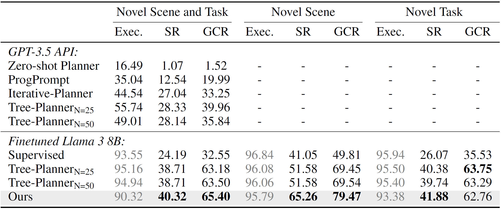
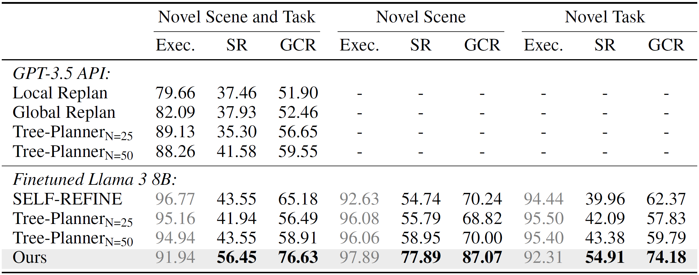
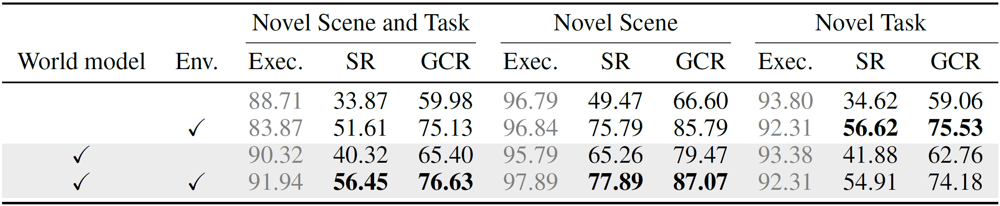

# Equilibrium Planner

## Requirements

+ Linux with python ≥ 3.9 and CUDA ≥ 11.8.

+ Install torch ≥ 2.3.0, transformers ≥ 4.43.1, flash-attn ≥ 2.6.1 and bitsandbytes ≥ 0.43.0.

+ Prepare base model:

  + Download [Meta-Llama-3-8B-Instruct](https://huggingface.co/meta-llama/Meta-Llama-3-8B-Instruct) to  your `MODEL_DIR` in `utils/predefine.py`.

  + Move the customized llama model to `MODEL_DIR/Meta-Llama-3-8B-Instruct` and overwrite the config file:

    ```shell
    mv llama3/* MODEL_DIR/Meta-Llama-3-8B-Instruct/
    ```

+ Prepare dataset:

  + Download [VirtualHome-Env](http://virtual-home.org/release/programs/programs_processed_precond_nograb_morepreconds.zip) and unzip it to your `RAW_DATA_DIR` in `utils/predefine.py`.

## Getting Started

+ Preprocess dataset:

  ```shell
  python prepare_dataset.py
  ```

+ Training for equilibrium planner:

  ```shell
  CUDA_VISIBLE_DEVICES=0 python run_finetune.py
  ```

+ Training for world model:

  ```shell
  CUDA_VISIBLE_DEVICES=0 python run_finetune_worldmodel.py
  ```

+ Generation for equilibrium planner in different settings:

  + Equilibrium planner with environmental feedback:

    ```shell
    CUDA_VISIBLE_DEVICES=0 python run_generate.py
    ```

  + Equilibrium planner with world model feedback:

    ```shell
    CUDA_VISIBLE_DEVICES=0 python run_generate.py --world_model_feedback
    ```

  + Equilibrium planner with both environmental and world model feedback:

    ```shell
    CUDA_VISIBLE_DEVICES=0 python run_generate.py --mixed_feedback
    ```

+ Evaluation in the VirtualHome graph simulator:

  ```shell
  python evaluation.py
  ```

## Results

+ Performance on VirtualHome-Env without correction (only world model feedback):

  

+ Performance on VirtualHome-Env with up to 10 corrections (both environmental and world model feedback):

  

+ Effectiveness of different types of feedback:

  

## Acknowledgement

+ Our implementation in `llama3` is based on [transformers](https://github.com/huggingface/transformers) and implementation in `evolving_graph` is based on [virtualhome-1.0.0](https://github.com/xavierpuigf/virtualhome/releases/tag/v1.0.0).

